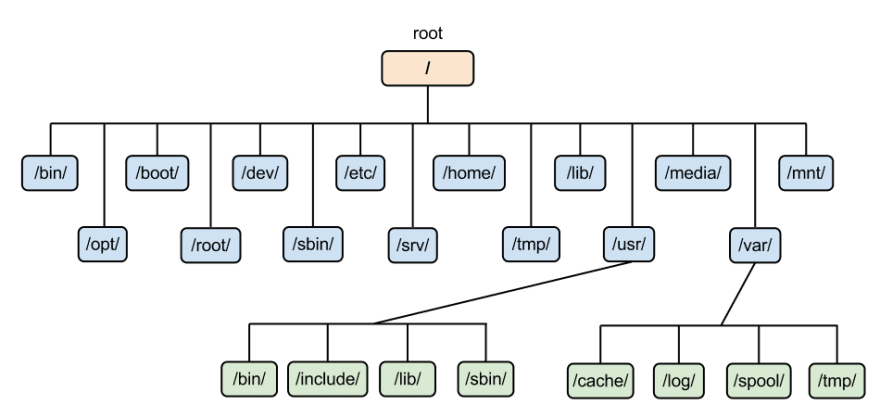

# Operasi File dan Struktur Direktori

### POKOK BAHASAN
    * Operasi File pada Sistem Operasi Linux
    * Struktur Direktorypada Sistem Operasi Linux

##TUJUAN BELAJAR:
Setelah mempelajari materi dalam bab ini, mahasiswa diharapkan mampu: 
* Memahami organisasi file dan direktory pada sistem operasi Linux 
* Menciptakan dan manipulasi directory
* Memahami konsep link dan symbolic link

## DASAR TEORI:

### 1. ORGANISASI FILE

Sistem file pada Linux menyerupai pepohonan (tree), yaitu dimulai dari  root, kemudian direktori dan sub dirrektori.  Sistem file pada Linux diatur secara hirarkhikal, yaitu dimulai dari root dengan symbol “/”. 
.

Kita dapat menciptakan File dan Direktori mulai dari root ke bawah.   Direktori adalah file khusus, yang berisi nama file dan INODE (pointer yang menunjuk ke data / isi file tersebut).   Secara logika, Direktori dapat berisi File dan Direktori lagi (disebut juga Subdirektori).

Struktur direktori diatas adalah struktur direktori dari Debian Linux. Untuk distribusi Linux lainnya hampir sama, biasanya akan terdapat penambahan direktori yang disesuaikan dengan kustomisasi distronya. Terdapat dua jenis direktori, yaitu direktori yang dibuat untuk kebutuhan dari sistem operasi secara lngsung dan direktori yang dibuat untuk kebutuhan pengguna dan packages yang dibutuhkan oleh pengguna. Seperti yang diilustrasikan oleh https://twitter.com/Mahmoud_Zalt/status/874792350912053249/photo/1.
.

### 2. TIPE FILE
Pada Linux terdapat 6 buah tipe file yaitu: 
1. Ordinary file
2. Direktori
3. Block Device (Peralatan I/O):  
   Merupakan representasi dari peralatan hardware yang menggunakan transmisi data per block (misalnya 1 KB block), seperti disk, floppy, tape. 
4. Character Device (Peralatan I/O):  
   Merupakan representasi dari peralatan hardware yang menggunakan transmisi data karakter per karakter, seperti terminal, modem, plotter dll
5. Named Pipe (FIFO)
    File  yang  digunakan  secara  intern  oleh  system  operasi  untuk  komunikasi  antar proses
6. Link File

### 3. PROPERTI FILE

File mempunyai beberapa atribut, antara lain : 
1. **Tipe file**: menentukan tipe dari file, yaitu :

    ||**Karakter**|**Arti**|
    | :- | :- | :-|
    |**-**||File biasa|
    |**d**||Direktori|
    |**l**||Symbolic link|
    |**b**||Block special file|
    |**c**||Character special file|
    |**s**||Socket link|
    |**p**||FIFO|

2. **Ijin akses**: Menentukan hak user terhadap file ini
3. **Jumlah link** : jumlah link untuk file ini.
4. **Pemilik (Owner)**: menentukan siapa pemilik file ini
5. **Group** : menentukan group yang memiliki file ini
6. **Jumlah karakter**    : menentukan ukuran file dalam byte
7. **Waktu pembuatan** : menentukan kapan file terakhir dimodifikasi
8. **Nama file**              : menentukan nama file yang dimaksud

Secara visual, properti sebuah file dapat digambarkan sebagai berikut (sumber : https://www.oreilly.com/library/view/unix-filesystems-evolution/9780471456759/chap02-sec003.html):

.

### 4. Ijin Akses
Linux menerapkan hak akses file yang sangat ketat, setiap file akan dibeli label file attribute) yang menjabarkan hak akses untuk user dan group terhadap file tersebut. Hanya user dan group tertentu yang bisa membaca,memodifikasi dan mengeksekusi file tersebut. Atribut ini sering disebut dengan *file permission*.
Alasan utama penerapan atribut ini adalah untuk alasan keamanan sistem. Dengan adanya pembatasan ini, maka sistem file yang penting dalam OS dapat terhindar dari modifikasi user yang tidak eligible (sumber: https://crunchify.com/in-java-how-to-set-file-permission-on-a-file-using-posixfilepermission-understanding-chmod-command/)
.

### **5   NAMA FILE**

Nama file maksimal terdiri dari 255 karakter berupa alfanumerik dan beberapa karakter spesial yaitu garis bawah, titik, koma dan lainnya kecuali spasi dan karakter **&**, **;**, **|**, **?**, **`**, **”**, **’**, **[**, **]**, **(**, **)**, **$**, **<**, **>**, **{**, **}**, **^**, **#**, **\\**, **/**.  Linux membedakan huruf kecil dengan huruf besar (case sensitive).  Contoh nama file yang benar :

---
Abcde5434

3 prog.txt PROG.txt Prog.txt,old

report\_101,v2.0.1

5-01.web.html

----